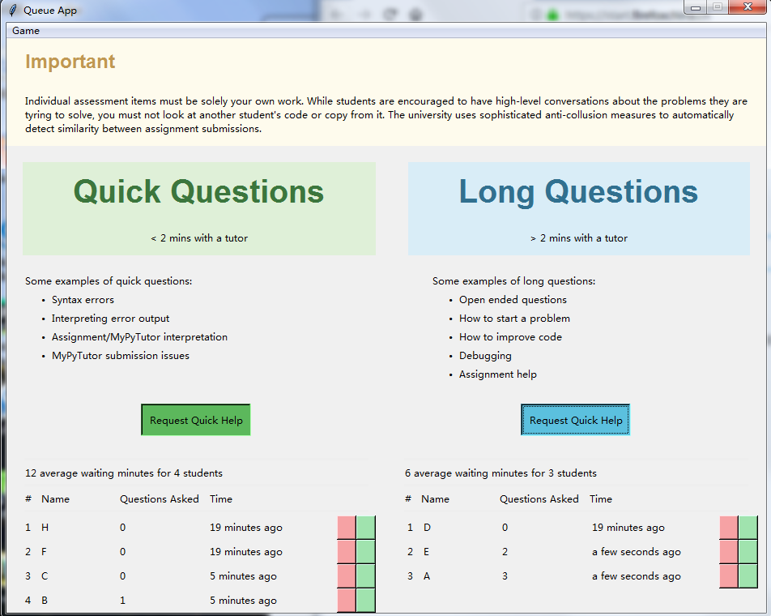
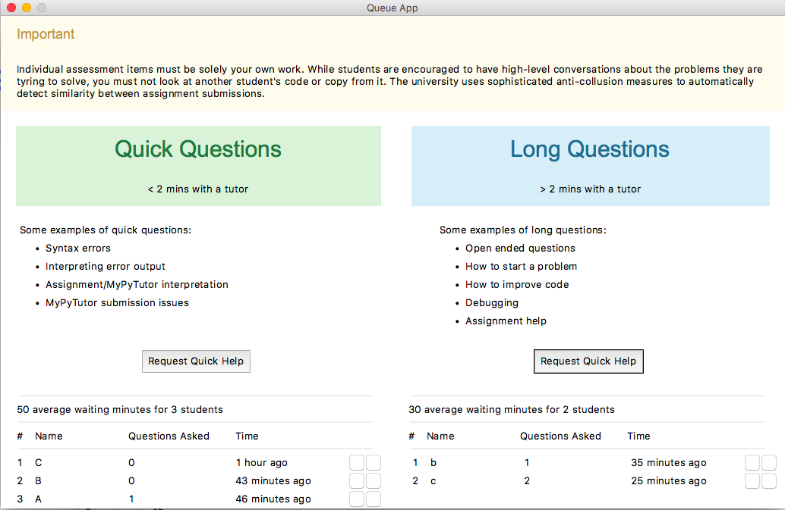

# Queue App

A Queue App that allow student to join, ask question and playing games while waiting.

No third party library requires

## Preview

on Windows:

on Mac:

## Project Structure

- `a3.py` main file, run `python3 a3.py` to run app 
- `breakout.py` game file
- `a3.pdf` assignment requirement
- `report.pdf` report showing how this app is build

