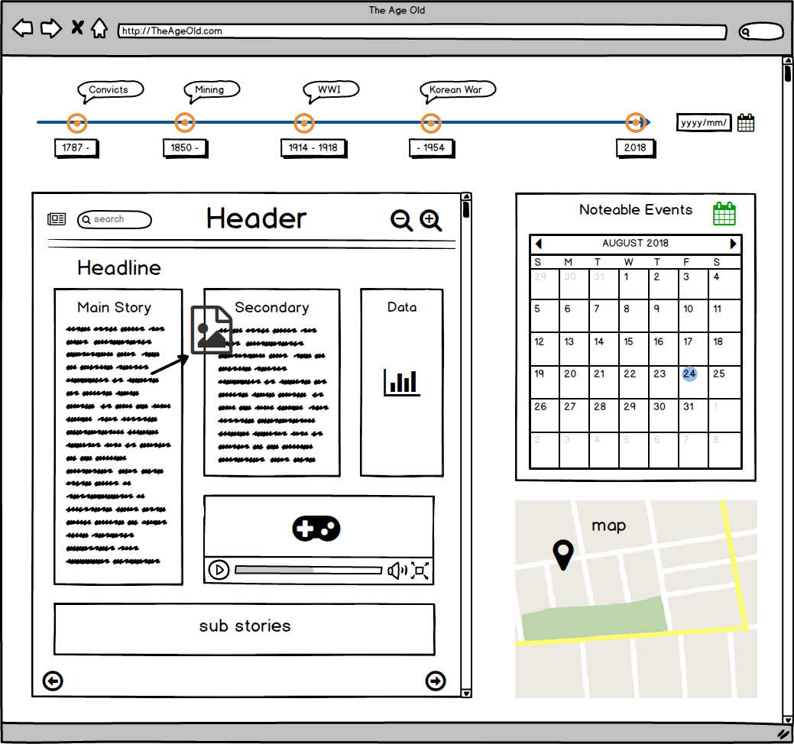

<style>
    p, ul {
        font-family: "Georgia";
    }

</style>

# Project A

This is the first part of our project, what we need to do is based on the provided [SLQ](https://search.data.gov.au/) data, researching and exploring them. Finally we have to narrow down our focus to specific theme and concept, for the preparation of our final website.

With those materials we did:
- **Scope** of our website
- **Background research**
- **Design concept**

## Before Start

Before we begin our project, we did some preparation first. As the main developer, i introduced [vscode](https://code.visualstudio.com/) to them and help them installed related plugins. We agreed to use [facebook](https://www.facebook.com/) for the daily contacting application and [google docs](https://www.google.com/docs/about/) for group documentation.

We did not use any version control management. However, for safety, i backed up our group work into my github [repositorie](https://github.com/hacker0limbo/UQ-BachIT/tree/master/DECO1800) just in case.


## Mock Up

With the aggrement, our team are going to make a `newspaper-like` website with totally 4 pages, each page with a data set and final page will be a summary page. Three data set are:

- [convict](https://data.gov.au/dataset/british-convict-transportation-registers) 
- [mining](https://data.gov.au/dataset/slq-queensland-mining-accidents-1882-1945)  
- [war](https://data.gov.au/dataset/portraits-of-soldiers-from-the-south-african-war-1899-1902)

With theme and concept cleared, our leader and designer drawed a rough website demo, based on the demo, i made a **mock up** website to demonstrate and future reference.



## AJAX and JSONP

Since in the workshop, the tutor introduced how to using `ajax` through `JQuery` to get data from API. However, the principle behind is quite interesting, i did some reseach about it although it does not help too much for the future website desing.

### AJAX

What is `AJAX`? `AJAX` is called **Asynchronous JavaScript And XML**, it is used to update asynchronously by exchanging data with web server behind the scenes. This means no data will be stored locally, all data will be achieved dynamically. 

Below is an example to create a `ajax`:

```javascript
const xhr = new XMLHttpRequest()

xhr.onreadystatechange = () => {
    if (xhr.readyState === 4) {
        if (xhr.status === 200) {
            // process data
        } else {
            // log error
            console.error(xhr.statusText)
        }
    }
}

xhr.onerror =  (e) => {
    console.error(xhr.statusText);
}

xhr.open('GET', '/endpoint', true);
xhr.send(null);
```

### JQuery AJAX

`JQuery` have encapsulated `ajax` code for us, which is `$.ajax()`.

```javascript
$.ajax({
    url: 'https://data.gov.au/api/3/action/datastore_search',
    data: data,
    success: (data) => {
        // process data
    }
});
```

### Limitation - Same origin policy
There is a policy called “Same-origin policy”, which is critical security mechanism that restricts how a document or script loaded from one origin can interact with a resource from another origin. Therefore, if we want to use ajax call to get data form other website, we have to guarantee that, two pages have the same origin if the protocol, port, and host are the same for both pages. For example, if `http://example1.com` send a http request to the `http://example2.com`, the second will not response that request since the same origin policy avoid it doing that, so that is one of the limitations that ajax contains, and to solve this, a mechanism called **Cross-Origin Resource Sharing (CORS)** should be implemented.

### CORS
The **Cross-Origin Resources Sharing (CORS)** is a mechanism that uses additional HTTP headers to tell a browser to let a web application running at one origin (domain) have permission to access selected resources from a server at a different origin. For security reasons, browsers restrict cross-origin HTTP request initiates from within scripts. One way to *break* this policy is using [JSONP](https://developer.mozilla.org/en-US/docs/Web/JavaScript/Reference/Global_Objects/JSON).

### JSONP
[JSONP](https://developer.mozilla.org/en-US/docs/Web/JavaScript/Reference/Global_Objects/JSON) is a JavaScript to request data by loading a `<script>` tag. It enables sharing of data by passing same-origin policy. The theory of it is quite simple, since the html tag `<script>` element is allowed to execute content retrieved from foreign origins. JSONP uses this advantages, and request files using the script tag instead of the XMLHttpRequest object. Also, JQuery has the library to do this, and we could also do that using pure JavaScript. Following are two examples using JQuery and JavaScript.

`JSONP` using `JQuery`:

```javascript
$.ajax('http://jsonp-aware-endpoint.com/user', {
    jsonp: 'callback',
    dataType: 'jsonp',
    data: {
        id: 123
    },
}).then((res) => {
    // handle request data 
})
```

`JSONP` using pure `JavaScript`:

```javascript
window.myCallback = (data) => {
    // handle data 
}

const scriptEl = document.createElement('script')
scriptEl.setAttribute('src', 'http://jsonp-aware-endpoint.com/user?callback=myCallback&id=123')
document.body.appendChild(scriptEl)
```

## LocalStorage
Since we do not want to calling `ajax` everytime user need to interactive with data, we could use `localStorage` to store data in browser session once the data has been called, in this case, `ajax` will only be called once, and the rest of time, data will only be extracted through browser locally.

```javascript
const data = {}

// store data and give data a name
localStorage.setItem('name', data)

// exract through specific name
const myData = localStorage.getItem('name')

// remove one data
localStorage.removeItem('name')

// clear all localstorage
localStorage.clear()
```

## Pug.js
The tradition way to make a page structure is writing `html`, however, html has several disadvantages, for example, you have to write a lot of reduant code. Therefore, **html template engine** appears and helps to slove this problem to some extent. One of the most famous html template engine is [pug](https://github.com/pugjs/pug). 

### Modular Development
This is very important for front-end. For instance, i wrote a `timeline` conpoment and there will be several pages need to use this component. It is unefficient to just copy html code to different pages, since once there will be little modifaction of the component, i have to go to all html pages to change code seperately to make sure all page's html code are exactly the same.

In order to handle this issue, frameworks appears. For example, in [react](https://reactjs.org/), you are able to use `JSX` to register a component and reuse or extend it. Similar principle for [Vue](https://vuejs.org/index.html) and [Angular](https://angular.io/)

```jsx
// A hello message component using react
class HelloMessage extends React.Component {
    render() {
        return (
            <div>
                Hello {this.props.name}
            </div>
        )
    }
}

ReactDOM.render(
    <HelloMessage name="Taylor" />,
    mountNode
)
```

### Mixins and Block
Since it will be quite complicated to use modern framework, and we do not have much time to learn, i finally decided to use `pug.js` html template engine to do the modular develop.

In `pug`, it provides two syntax to write *Component*, [Mixin](https://pugjs.org/language/mixins.html) and [block](https://pugjs.org/language/inheritance.html). Where `block` is more flexible, you can keep it origin or extend it by writing a child template. `mixin` is more like reuse another component. I mainly using `mixin` since it is easy to implement.

::: tip NOTE
Pug has a ruby style syntax, and it will finally be complied to original html once you installed its CLI through npm
:::

```pug
mixin pet(name)
    li.pet= name
ul
    +pet('cat')
    +pet('dog')
    +pet('pig')
```

This will be complied to below html:

```html
<ul>
    <li class="pet">cat</li>
    <li class="pet">dog</li>
    <li class="pet">pig</li>
</ul>
```