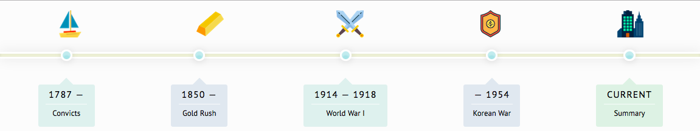
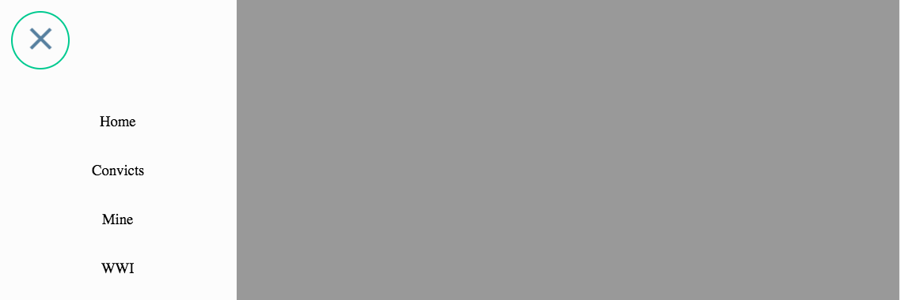

<style>
    p, ul {
        font-family: "Georgia";
    }

</style>


# Project B
This is the second part of Major Project. In this part, we have to build a progress demo to demonstrate the key technical/interactive features of our website.

## Components
Since this part is about to show a demo, i am in charge of doing components for our websites so that in the end will just be joining different components together to be a complete page.

Components that i did for this part are:
- Timeline
- Side navigation bar
- Flip book
- Games


### Timeline
The timeline component is all `html` and `css`. The basic structure is that, there will be a `div` for the *line*, and another `div` to set up all the entries content. Html structure are listed below:

```html
<section class="container">
    <div class="timeline">
        <!-- line part -->
    </div>
    <div class="entries">
        <div class='entry1'></div>
        <div class='entry2'></div>
        <div class='entry3'></div>
        <div class='entry4'></div>
    </div>
</section>
```

The final component looks like this:



### Side nav bar
To do this widget, i found a third party library called [pure drawer](http://mac81.github.io/pure-drawer/). It is a responsive side with css transition effect, only `html` and `css` required.

Here are core code to implement this component:

```html
<!-- link -->
<link rel="stylesheet" href="./pure-drawer.min.css">

<!-- drawer -->
<div class="pure-container" data-effect="pure-effect-slide">
    <input type="checkbox" id="pure-toggle-left" class="pure-toggle" data-toggle="left">
    <label class="pure-toggle-label" for="pure-toggle-left" data-toggle-label="left">
        <span class="pure-toggle-icon"></span>
    </label>

    <div class="pure-drawer" data-position="left">
        <!-- Nav information goes here -->
    </div>
    <div class="pure-pusher-container">
        <div class="pure-pusher">
            <!-- Site content goes here -->
        </div>
    </div>
    <label class="pure-overlay" for="pure-toggle-left" data-overlay="left"></label>
</div>
```

Here is the final component demo:



### Flip book
In order to simulate a book page turn effect, i found a `JQuery` based website called [turn.js](http://www.turnjs.com/). It allows you to make a *book* in the page containing flip effect. This library provides several configuration such as page flip speed. But i just used the default configuration to keep it simple.

Code are showing below:

```html
<div id="flipbook">
	<div class="hard"> Turn.js </div>
	<div class="hard"></div>
	<div> Page 1 </div>
	<div> Page 2 </div>
	<div> Page 3 </div>
	<div> Page 4 </div>
	<div class="hard"></div>
	<div class="hard"></div>
</div>
<script type="text/javascript">
	$("#flipbook").turn({
		width: 400,
		height: 300,
		autoCenter: true
	});
</script>
```

The final demo looks like this:


### Games

For the games part, i designed two games since our personas are children, one is for mining page, another is for world war one.

#### Mining Game
This game is more like a [Minesweeper](https://en.wikipedia.org/wiki/Minesweeper_(video_game)) game.

For this game, i did not use any third party library, I have designed this game before so that i just referenced some code from my past game code and made a little changes. In fact, this game requires a little bit data structure knowledge. I will illustrate briefly below:

Technically, i used `array` to record each position's information. Considering there will be a grid full of squares, for each square there will just be 8 adjacent squares. So to demonstrate this into code, i used array:

```javascript
[
    [a, b, c],
    [d, e, f],
    [g, h, i],
]
```

Element `e` is the centre square. A square could be `0 ~ 9`, `0 ~ 8` representing that there will be different numbers bombs around this square, `9` represents that itself is a bomb. Therefore, some key functions are listed below:

```javascript
cont copySquare = (square) => {
    let a = []
    for (let i = 0; i < square.length; i++) {
        let s = square[i]
        let ss = s.slice(0)
        a.push(ss)
    }
    return a
}

const plus = (array, x, y) => {
    if (x >= 0 && x < array.length && y >= 0 && y < array[0].length) {
        if (array[x][y] != 9) {
            array[x][y] += 1
        }
    }
}

const mark = (array, x, y) => {
    plus(array, x - 1, y - 1)
    plus(array, x - 1, y)
    plus(array, x - 1, y + 1)

    plus(array, x, y - 1)
    plus(array, x, y + 1)

    plus(array, x + 1, y - 1)
    plus(array, x + 1, y)
    plus(array, x + 1, y + 1)
}

const markedSquare = (array) => {
    let a = copySquare(array)
    for (let i = 0; i < a.length; i++) {
        for (let j = 0; j < a[i].length; j++) {
            if (a[i][j] == 9) {
                mark(a, i, j)
            }
        }
    }
    return a
}
```

The game runs like this:


#### War Game
For the war game, I planned to make a shooting game and once the bullet hits a soldier, a random data will be displayed showing detailed information about that data based on `SLQ` data set.

Things goes complicated here. Unlick the `mining game`, this shooting game requires much complicated logic, for example, you would have to determine whether two objects overlapped or not. Although it is possible to do it by hand, using a third party library will be quicker and easier. [phaser.js](https://phaser.io/) provides complete functions to implement this.

I currently using `phaser2` since it uses `Canvas` rather than `WebGL`, and browser originally support `Canvas` since it is a new `html5` element.

`phaser.js` is one of the most famous `JavaScript` game engine. To make a game, you would have to do such steps:

- Load sprite images
- create a stage for sprites
- update game relative data.

For my shooting game, the main structure looks like this:

```javascript
const game = new Phaser.Game(...)

const preload = () => {
    // preload sprite images
}

const create = () => {
    // add sprites to stage
}

const update = () => {
    // update game info
}

const fireBullet = (bullet) => {
    // fire a bullet
}

const resetBullet = () => {
    // kill the bullet if the bullet are out of the canvas
}

const collisionHandler = (bullet, obj) => {
    // handle collison when object overlapped.
}
```

The final game could be played like this:


## CSS Animation
Although css is not my strong part, i still did a lot of css work during project. Generally we used two css animation libraries: [animate.css](https://daneden.github.io/animate.css/) and [hover.css](http://ianlunn.github.io/Hover/). Both two libraries provides simpel but powerful features.

### Animate.css
This library provides lots of traditional css animation, to add animation, one way to do is just add class name for needed tag. Examples are showing below:

```html
<!-- This will add bounce effect to the <h1> tag -->
<h1 class="animated infinite bounce delay-2s">Bounce</h1>
```

### hover.css
This library provides many hover effect animations. Examples showing below:

```html
<!-- This will add rotate effect when user's mouse hover on this link-->
<a href="#" class="hvr-rotate">Rotate</a>
```